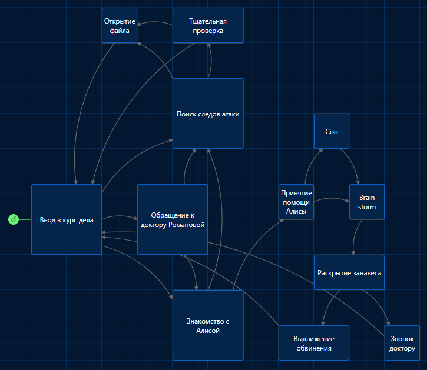

# Quiz bot

This is a bot for telegram, which can create quiz

## How to use

1. Clone this repository
2. Install requirements
3. Create `.env` file with `TOKEN` variable
4. Run `python3 bot.py`
5. Answer the questions
6. Enjoy!

## Used twinery.org for creating quiz

